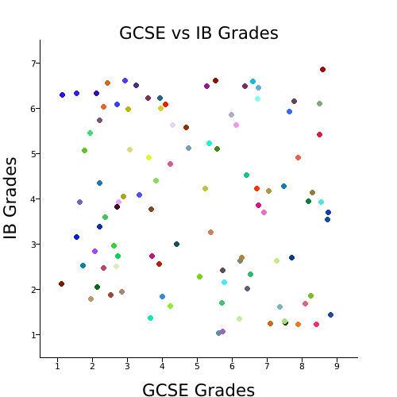

## What is Rusterize?
Rusterize is a project I'm working on to build good-looking charts in Rust. This crate is inspired by matplotlib, but doesn't necessarily aim to replace its capabilities.

Rusterize is a heavy WIP. Feel free to contribute if you have time.

### An example of what Rusterize is currently capable of:

#### Scatter Graphs



Running `cargo test` reported that it took `0.38s` to generate. The test can be seen in `src/lib.rs`, which used `100` pairs of `(f32, f32)` data. Keep in mind this is the time it took to run the test + any additional procedures cargo needs to run. This was run on the following machine:
```diff
Model Name:	MacBook Pro
+ Model Identifier:	MacBookPro11,3
+ Processor Name:	Quad-Core Intel Core i7
+ Processor Speed:	2.8 GHz
Number of Processors:	1
Total Number of Cores:	4
L2 Cache (per Core):	256 KB
L3 Cache:	6 MB
Hyper-Threading Technology:	Enabled
+ Memory:	16 GB
System Firmware Version:	474.0.0.0.0
```